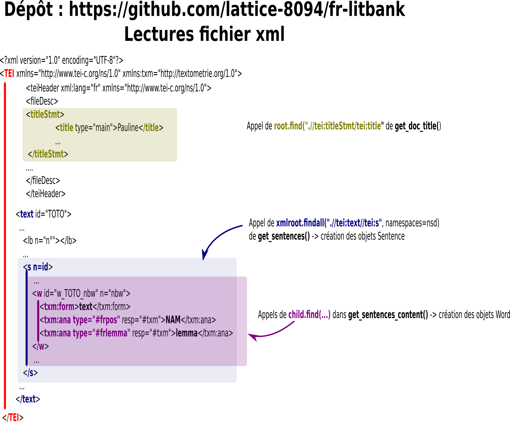
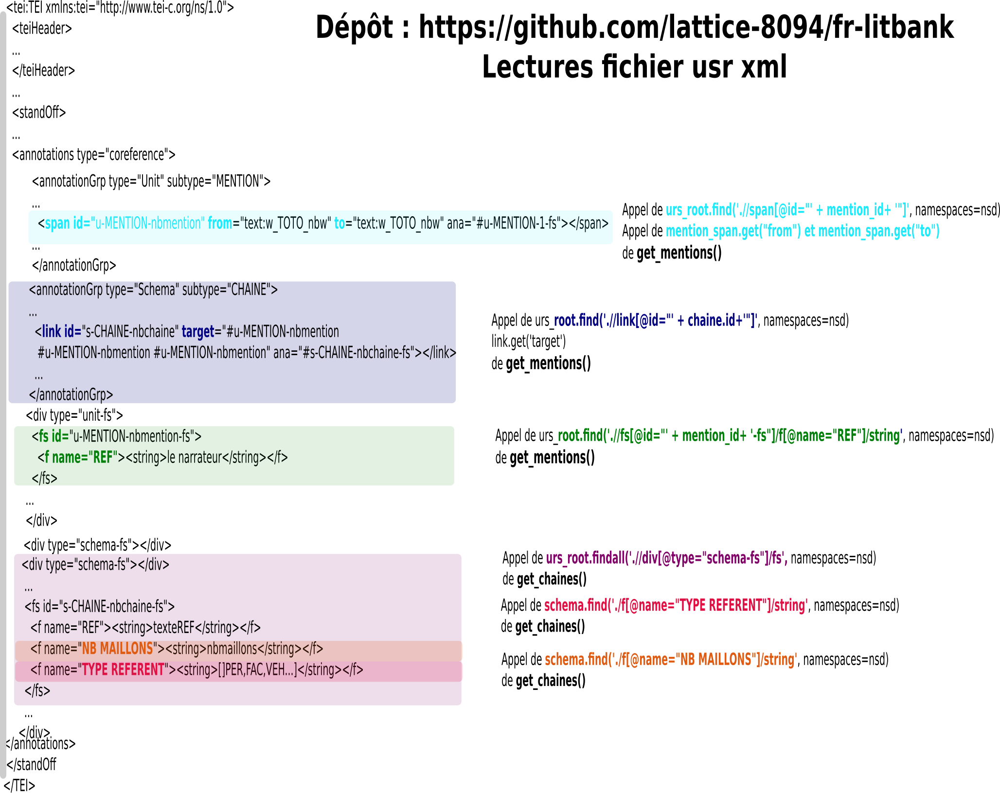

# Passage du format d'annotations DEMOCRAT au format BRAT

## Formats de départ (democrat)

Les formats annotés récupérés par l'export dans le logiciel TXM sont de la forme :

### Pour les fichiers.xml

 

## TOTO-URS.XML



## Formats d'arrivée (Brat)

Le détail est ici : [Standoff format - brat rapid annotation tool](https://brat.nlplab.org/standoff.html)

### Text file (.txt)

Texte simple du roman ou partie du roman retenu.

### Annotation file (.ann)

T -> Entity

    Named entities are phrases that contain the names of persons,
organizations, locations, times and quantities.
Example (https://www.clips.uantwerpen.be/conll2002/ner/)

> [PER Wolff ] , currently a journalist in [LOC Argentina ] , played with [PER Del Bosque ] in the final years of the seventies in [ORG Real Madrid ] .

E -> Event ...

```
Tid<tab>type<espace>start-offset<espace>end-offset<tab>texte
```

A compléter avec les autres types d'annotations ...

## Algorithme

### Feuilles de style pour l'import dans TXM

Pour recréer le fichier texte à partir du fichier toto.xml de départ, il faudrait retrouver la feuille de style (.XSL ?) utilisée dans le logiciel TXM. On pourrait utiliser un programme simple qui concanète chaque morceau de texte (cf dans toto.xml balises w et txm:form) en ajoutant un espace entre chaque systématiquent mais on aura, par exemple des espaces avant les virgules, les points, les tirets, après les apostrophes et les dialogues seront mal retranscris, etc ...

[Bibliothèque XSLT](https://txm.gitpages.huma-num.fr/textometrie/files/library/xsl/#feuilles-de-style-de-base-pour-filtrer-les-sources-xml)

[tei.xsl ](https://forge.cbp.ens-lyon.fr/redmine/projects/txm/repository/entry/tmp/org.txm.core/res/org/txm/xml/xsl/tei/xhtml2/tei.xsl)

### Réflexions et tests

- Une solution serait de construire une structure de tableau ( avec pandas ) avec :
  
  | texte    | nbw  | nbmention | nbchaine | TYPE REFERENT | REF      |
  | -------- | ---- | --------- | -------- | ------------- | -------- |
  | la       | 1354 | 316       | 57       | PER           | Laurence |
  | personne | 1355 | 317       | 57       | PER           | Laurence |
  | qu'      | 1362 | 318       | 57       | PER           | Laurence |
  | elle     | 1384 | 324       | 57       | PER           | Laurence |
  | ...      |      |           |          |               |          |
  | Laurence | 9399 | 2531      | 57       | PER           | Laurence |
  | ...      |      |           |          |               |          |

- Il peut y avoir plusieurs nbw pour 1 nbmention

- Il peut y avoir plusieurs nbmention pour 1 nbchaine

- TYPE REFERENT et REF sont liés à la chaine (nbchaine)

- Tout le texte est "taggué" avec les balises w id, on peut donc reconstituer le texte à partir de ces balises. Ce qui n'est pas possible avec les balises mention qui contiennent une plage de balises w id ( from w id to w id) continues mais entre deux mentions continues, il peut y avoir un saut de balises w id (ex : mention 10 from w id 12 to 15, mention 11 from w id 20 to w id 22). De plus une mention peut contenir des balises w id déjà présentes dans d'autres mentions (Ex : dans Pauline, chaine 1619 avec 11 mentions/maillons dont "son serin" et "ses" de ses forces et chaine 1632 avec 1 mention "toutes ses forces", le w id "ses" est inclus dans 2 mentions différentes)

- Dans les balises w id, on a aussi des éléments #frpos = [tag Part Of Speech](https://www.cis.uni-muenchen.de/~schmid/tools/TreeTagger/data/french-tagset.html)

- L'idée sera de garder les mentions dont au moins un w id a un #frpos = NAM ou NOM

## Liens

- Outil pour lire les fichiers BRAT : https://brat.nlplab.org/ 

- Il est installé au Lattice : https://apps.lattice.cnrs.fr/brat/index.xhtml#/litbank/entities/
